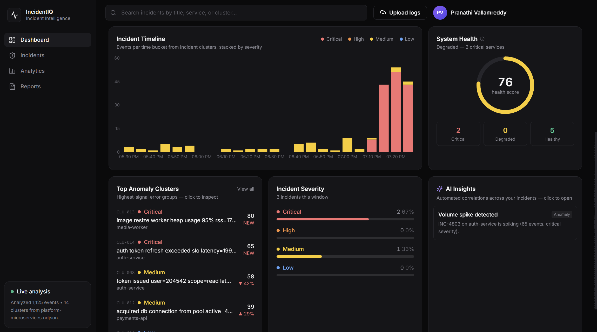
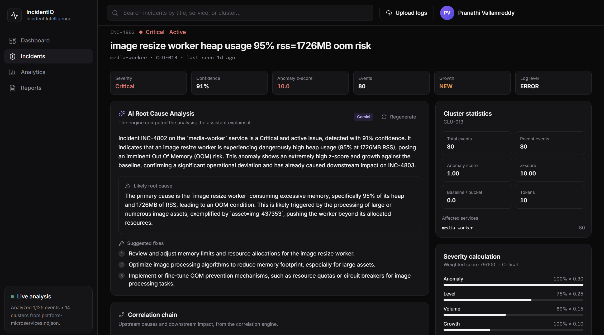
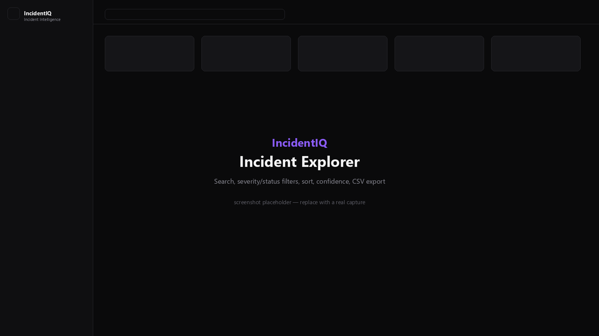
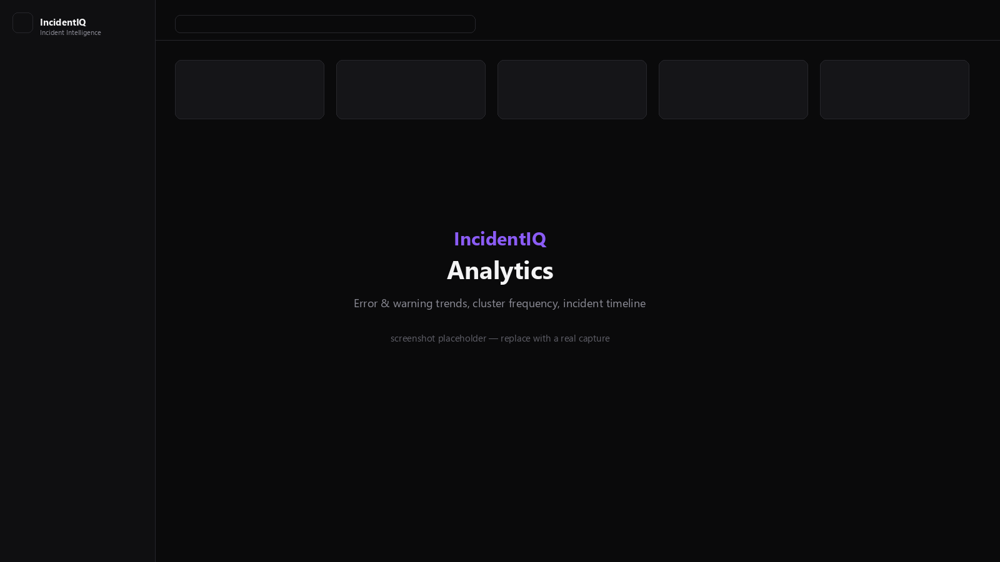
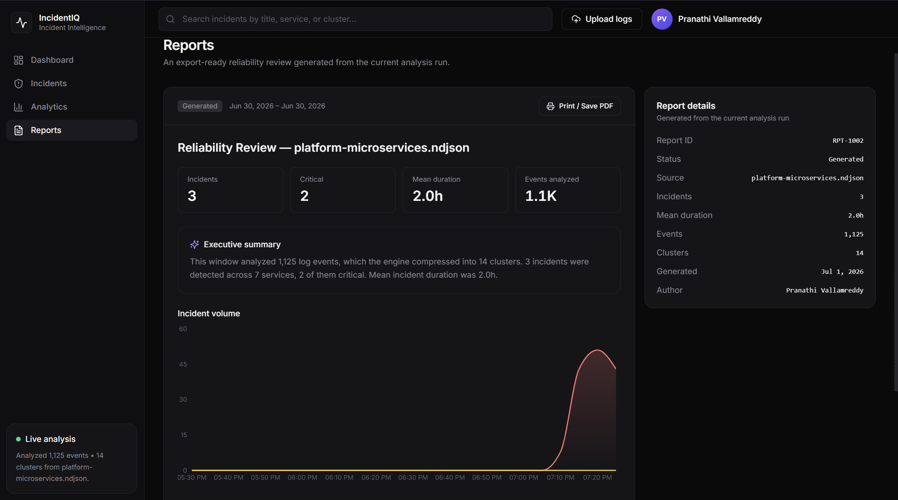

# IncidentIQ — AI-Assisted Incident Intelligence & Log Analysis

IncidentIQ ingests raw application logs and turns them into ranked, explained
incidents. A real analysis **engine** does the work — parsing, template mining,
clustering, frequency analysis, anomaly detection, severity scoring and
correlation. A large language model is used **only** to phrase the engine's
structured output in plain language, with a deterministic fallback so every
feature works without an API key.

> **Thesis:** the detection engine is the product; the AI is an assistant. No log
> is ever sent to a model to "figure out what happened" — the engineering
> computes the analysis, and the model only explains it.

**Live demo:** **[incident-iq-mu.vercel.app](https://incident-iq-mu.vercel.app)** · API: [incidentiq-api-ozj5.onrender.com/api/health](https://incidentiq-api-ozj5.onrender.com/api/health)

> The backend is on Render's free tier — the first request after idle may take
> ~50s to cold-start. The app auto-seeds a sample analysis so it's never blank.

---

## Screenshots



| Incident Detail (the centerpiece) | Incident Explorer |
|---|---|
|  |  |

| Analytics | Reports |
|---|---|
|  |  |

---

## What to look at 

- **A from-scratch [Drain](https://github.com/logpai/Drain3)-inspired template miner** (`engine/templates.py`) — a fixed-depth parse tree, not a library call.
- **Statistically defensible anomaly detection** (`engine/anomaly.py`) — robust median/MAD baseline with a Poisson-style scale floor and a **√(2·ln n) scan correction** for the multiple-comparisons problem of scanning many time buckets.
- **A transparent severity engine** (`engine/severity.py`) — a documented weighted blend surfaced in the UI, not a black box.
- **A correlation engine** (`engine/correlation.py`) — a service-dependency graph that detects cascades (e.g. *checkout 5xx is downstream of DB pool exhaustion*), which the AI then explains by name.
- **The Incident Detail page** — exposes the full reasoning chain: detected template, normalized log, anomaly z-score, weighted severity breakdown, correlation chain, sample logs, and the AI explanation with an honest source badge.
- **Honest UX** — every displayed number is engine-computed; there is no fake interactivity, and the AI clearly labels whether Gemini or the deterministic explainer produced each result.

---

## Pipeline

```
Upload / sample  ─►  Parser  ─►  Normalization  ─►  Drain template mining
                                                          │
                                                          ▼
      Correlation  ◄─  Severity  ◄─  Anomaly  ◄─  Frequency  ◄─  Clustering
           │
           ▼
     Incidents  ─►  API  ─►  Dashboard · Explorer · Incident Detail
                                                    │
                                                    ▼
                                   AI explanation (Gemini or deterministic)
```

Everything left of the API is a pure, framework-independent Python package
(`backend/app/engine`) with no FastAPI or SQLAlchemy imports — and it is covered
by golden-fixture unit tests.

---

## The engine (the interesting part)

| Stage | File | What it does |
|---|---|---|
| **Parser** | `engine/parser.py` | Multi-format: NDJSON (flexible keys), structured text (`ts LEVEL service msg`, bracketed levels, syslog-ish), and a never-drop fallback. Synthetic monotonic clock for timestamp-less lines. |
| **Normalization** | `engine/normalize.py` | Ordered regex masking of variable tokens (UUID, IP, email, URL, duration, size, hex, path, number …) to typed sentinels, so `db-7 after 1423ms` and `db-3 after 88ms` collapse to one template. |
| **Template mining** | `engine/templates.py` | A from-scratch **Drain-inspired** miner: fixed-depth parse tree (length layer → prefix layers → leaf), similarity match against candidates, wildcard generalization on divergence. ~O(depth) per line vs O(n²) pairwise. |
| **Clustering** | `engine/clustering.py` | Lifts templates into enriched clusters (services, level, first/last seen, examples). |
| **Frequency** | `engine/frequency.py` | Buckets each cluster's events over the window; computes recent-vs-baseline rate and growth %. |
| **Anomaly** | `engine/anomaly.py` | Robust **peak detection**: median baseline, MAD/Poisson-floored scale, and a **√(2·ln n) scan correction** so the max over many buckets isn't fooled by normal noise. Flags active vs. resolved spikes. |
| **Severity** | `engine/severity.py` | Transparent weighted blend — anomaly (0.30), level (0.25), service criticality (0.15), volume (0.15), growth (0.10), breadth (0.05) → Critical/High/Medium/Low. Separate confidence signal from evidence strength. |
| **Correlation** | `engine/correlation.py` | Directed cause chains from a static service-dependency graph (+ temporal co-occurrence). Surfaces "checkout 5xx is downstream of DB pool exhaustion". |

Run it standalone (no web layer):

```bash
cd backend
python -m app.data.generate_samples          # write sample datasets
python -c "from app.engine import pipeline; from pathlib import Path; \
  r=pipeline.analyze_text('demo', Path('app/data/samples/ecommerce-cascade.log').read_text()); \
  print(len(r.incidents), 'incidents,', len(r.correlations), 'correlations')"
```

---

## AI integration

The `/api/incidents/{id}/explain` endpoint hands Gemini **only the engine's
structured result** (template, severity, anomaly z-score, growth, correlation
chain) — never raw logs for detection. It asks the model to phrase, not to
analyze.

- **With `GEMINI_API_KEY` set** → the current `google-genai` SDK calls
  `gemini-2.5-flash` (configurable via `GEMINI_MODEL`); the Incident Detail page
  shows a **"Gemini"** badge.
- **Without a key, or on any API error** → a rule-based `explain_deterministic`
  produces an identically-shaped result; the page shows a **"Deterministic"**
  badge and an honest note. Failures are logged at WARNING (never silently
  swallowed), so the fallback reason is always visible in server logs.

---

## Stack

- **Backend:** FastAPI · SQLAlchemy (SQLite) · Pydantic · pure-Python engine.
- **Frontend:** React · Vite · TypeScript · Tailwind · Recharts.
- **AI:** Google Gemini (optional) via the `google-genai` SDK, with a
  deterministic rule-based explainer as fallback.

---

## API surface

| Method | Path | Purpose |
|---|---|---|
| `GET` | `/api/health` | Liveness + whether AI is configured |
| `GET` | `/api/samples` · `POST /api/samples/{name}/load` | List / analyze bundled datasets |
| `POST` | `/api/logs/upload` | Analyze an uploaded file |
| `GET` | `/api/runs/latest` | Lightweight current-run summary (sidebar) |
| `GET` | `/api/dashboard` | KPIs, pipeline stats, timeline, health, top clusters, insights |
| `GET` | `/api/incidents` | Filter by `severity` / `status` / `q` |
| `GET` | `/api/incidents/{id}` | Full detail: template, normalized log, stats, severity factors, correlation chain |
| `POST` | `/api/incidents/{id}/explain` | Generate explanation (Gemini or deterministic) |
| `GET` | `/api/incidents/export` | CSV export |
| `GET` | `/api/analytics` | Trends, cluster frequency, incident timeline |

---

## Local development

**Backend** (http://localhost:8000):

```bash
cd backend
pip install -r requirements.txt          # or requirements-dev.txt for tests
python -m app.data.generate_samples
uvicorn app.main:app --reload --port 8000
```

**Frontend** (http://localhost:5173, proxies `/api` → :8000):

```bash
cd frontend
npm install
npm run dev
```

Open the app, click **Upload logs**, and load `ecommerce-cascade.log` to
reproduce the full incident board including the payments → checkout cascade.

To enable live Gemini explanations, set `GEMINI_API_KEY` in `backend/.env`
(copy from `.env.example`). Without it, the deterministic explainer is used.

---

## Testing

```bash
cd backend
pip install -r requirements-dev.txt
python -m pytest -q          # 25 tests: engine golden fixtures + API
```

Covers parsing formats, normalization stability, template grouping/merging,
cascade detection, severity ordering, resolved-incident detection, pipeline
determinism, and the full API surface.

---

## Deployment

Architecture: the browser calls same-origin `/api`, and Vercel rewrites those
requests to the Render backend server-side (`vercel.json`), so there is no
build-time API URL to configure.

**Backend → Render** (`backend/render.yaml` blueprint):
- Create a Blueprint from this repo (Blueprint Path `backend/render.yaml`).
- Build generates the sample datasets; start runs uvicorn; health check `/api/health`.
- `GEMINI_API_KEY` (and optional `GEMINI_MODEL`) enable live Gemini; blank → deterministic.

**Frontend → Vercel** (`frontend/vercel.json`):
- Set the Vercel project's **Root Directory to `frontend`** (monorepo).
- Set the `/api/:path*` rewrite **destination** to your Render URL. Leave
  `VITE_API_BASE` unset so the app uses the same-origin `/api` proxy.
- `vercel.json` builds the Vite app, serves `dist/`, and falls back all routes to
  `index.html` for client-side routing.

> **Data persistence:** SQLite on Render's ephemeral free-tier disk resets on
> redeploy/cold start; on startup the app auto-seeds the `ecommerce-cascade`
> sample (via the real engine) if the DB is empty, so a fresh deploy is never
> blank.

---

## Deliberate scope choices

To keep the focus on engineering depth, the product surface is intentionally
scoped — without any fake interactivity:

- **No authentication** — a single demo workspace; no user accounts or settings UI.
- **Engine defaults** — detection thresholds (anomaly sensitivity, AI toggle) use
  sensible defaults rather than an inert settings screen.
- **Reports** are generated live from the current run and exported via the browser
  print dialog (Save as PDF).
- **Batch, not streaming** — the "Live analysis" card reflects a completed batch
  run over uploaded logs, not a streaming pipeline.

None of these touch the analysis engine, which is the core of the project.

---

## Author

**Pranathi Vallamreddy** — [github.com/Pranathi-Vallamreddy](https://github.com/Pranathi-Vallamreddy)
